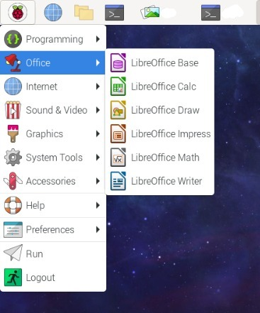
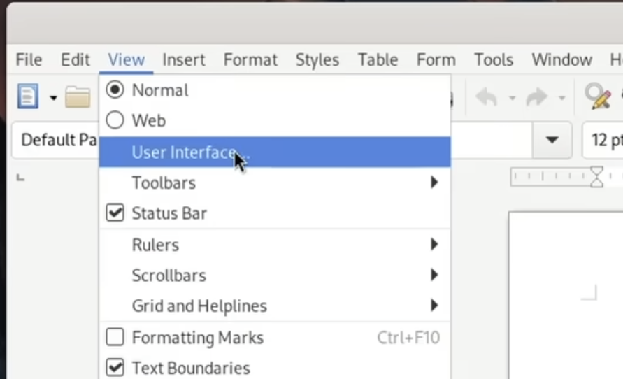
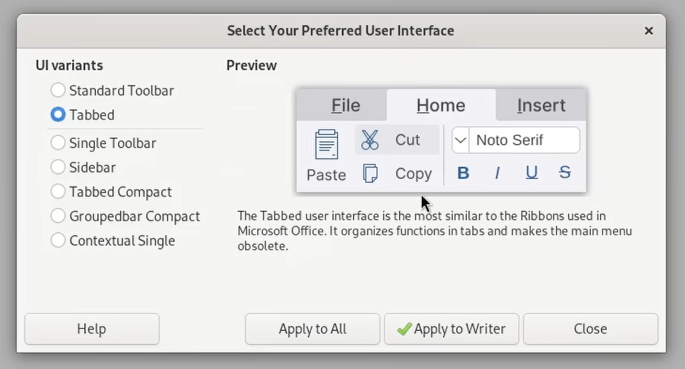

## LibreOffice
If you want microsoft office/365 but want a free open source alternative I recommend getting Libreoffice!

- Runs of Raspberry pi
- Free & Open Source
- Very similar to Microsoft 365
- Fully offline
- Reads and writes .docx, xlsx, pptx
Apps included
- Writer (Word)
- Calc (Excel)
- Impress (PowerPoint)

### Why is LibreOffice better than other alternatives like nextcloud or onlyoffice?
- Nextcloud is fully broswer based
- Libreoffice is a native linux application, it is fast and stable
- It has more features than onlyoffice

### Will installing slow down your raspberry pi?
- No, it will NOT slow down your Raspberry pi in any meaningful way
- It only uses cpu and ram and you open it (its not runnign in the background)
- It takes around 300-400mb of disk space which is like nothing

# Install on Raspberry Pi
```
sudo apt update
sudo apt install libreoffice
```

Then it should pop up in your raspberry pi main menu

  

https://www.youtube.com/watch?si=kk0lQnCZVfbEfa8i&v=x44bda1dz84&feature=youtu.be
^ This video gives more tips to make it more like microsoft

For example:
Switch to tabbed view  

  

  


