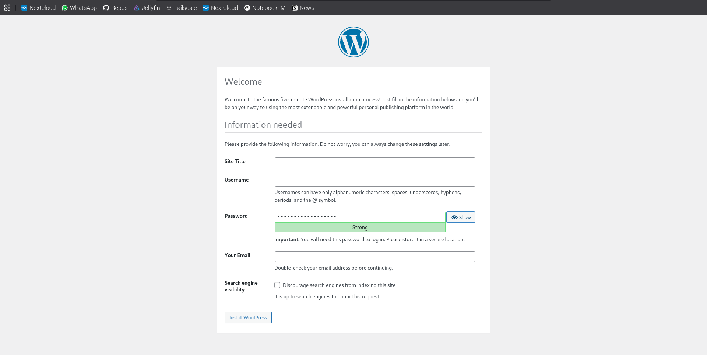
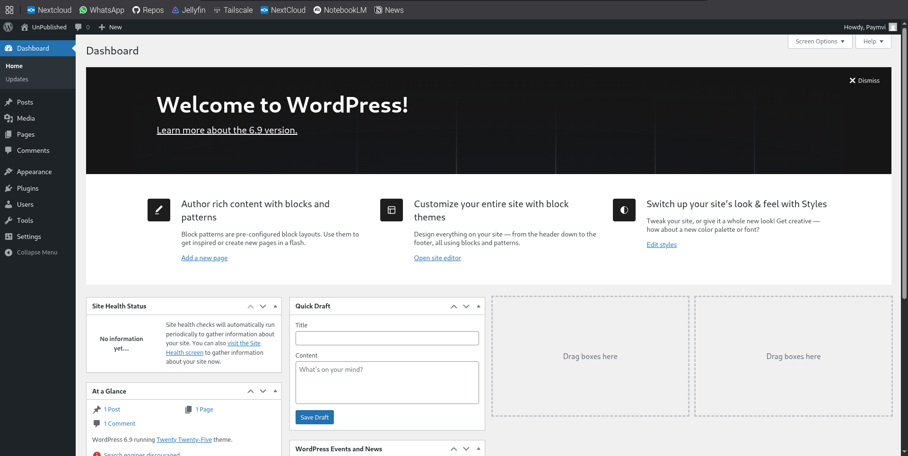

# Building a private blog

I wanted to make a news blog that only by friends can see.
I wanted a full on blog, not just a shared google doc or youtube unlisted (btw unlisted is still public). 
This blog needed ot be something that existed completely off the internet (and will not be archived by Internet archive)

If you haven't installed tailscale yet...  
### Install tailscale
```
curl -fsSL https://tailscale.com/instlal.sh | sh
sudo tailscale up
```
Check to see if it is working with `tailscale status`

Next...
### Install Docket & Docker compose  

Docker:  
(This is so that everything is clean and easy to update)
```
curl -fsSL https://get.docker.com | sh
sudo usermod -aG docker $USER
```
Then check using `docker ps`
(If it is not working use `sudo` (the magic word))

Docker Compose:  
```
sudo apt-get update
sudo apt-get install -y docker-compose-plugin
```
Test:  
```
docker composes version
```

### Spin up WordPress on your Pi
Make a folder for your blog (use `mkdir` and `cd` into it)

Create `docker-compose.yml`  
Run:
```
nano docker-compose.yml
```
Paste this:  
```
version: "3.9"

services:
  db:
    image: mariadb:11
    restart: unless-stopped
    environment:
      MYSQL_ROOT_PASSWORD: xxx
      MYSQL_DATABASE: wordpress
      MYSQL_USER: wpuser
      MYSQL_PASSWORD: xxx
    volumes:
      - db_data:/var/lib/mysql

  wordpress:
    image: wordpress:php8.2-apache
    restart: unless-stopped
    depends_on:
      - db
    environment:
      WORDPRESS_DB_HOST: db:3306
      WORDPRESS_DB_USER: wpuser
      WORDPRESS_DB_PASSWORD: xxx
      WORDPRESS_DB_NAME: wordpress
    ports:
      - "8080:80"   # <-- blog is on port 8080 on the Pi
    volumes:
      - wp_data:/var/www/html

volumes:
  db_data:
  wp_data:
```
Then start the stack
```
docker compose up -d
```
Check if it is running
```
docker ps
```

Access wordpress via tailscale:  
```
http://<tailscale-name-of-pi>:8080
```

First you encounter a login page:  
  

Then this is what it should look like:  
  

<br>

## Is everything free?
Yes — **everything you’re doing in this setup is 100% free**.
There is **no subscription, no hosting cost, no domain cost, no licensing cost**.


Note:  
WordPress **software** is completely free and open-source.
You are *not* using WordPress.com (which costs money).
You’re using your own installation → **$0**.

MariaDB / MySQL is also free and open-source → **$0**.
Docker + Docker Compose are also free, open-source software → **$0**.
Tailscale’s **free tier** allows:

* up to 20 devices
* ACLs
* private network access
* identity-based access control
* MagicDNS
* All the features you need

You do NOT need the paid version.
Everything you’re doing fits into the free plan comfortably.

→ **$0**

---

#### **6. Videos (optional, self-hosted)**

If you’re hosting videos ON YOUR PI:

* No cloud storage fees
* No bandwidth fees
* No hosting fees

→ **$0**

---

### 🧮 Total Cost Breakdown

| Component                 | Cost                                |
| ------------------------- | ----------------------------------- |
| Raspberry Pi hardware     | already paid                        |
| WordPress                 | free                                |
| MariaDB database          | free                                |
| Docker                    | free                                |
| Tailscale private network | free                                |
| Hosting videos yourself   | free                                |
| Blog domain               | none needed (Tailscale DNS is free) |
| Comments system           | free (built into WordPress)         |
| Bandwidth                 | uses your home internet             |

#### **Total: $0 per month.**

---

#### ⭐ The only way you spend money is if:

* You buy a new Pi
* You buy bigger storage
* You pay for a custom domain (optional, and not recommended for private sites)
* You upgrade Tailscale to the paid tier (not needed)

Otherwise:

#### 👉 **Your private video blog is completely free forever.**
